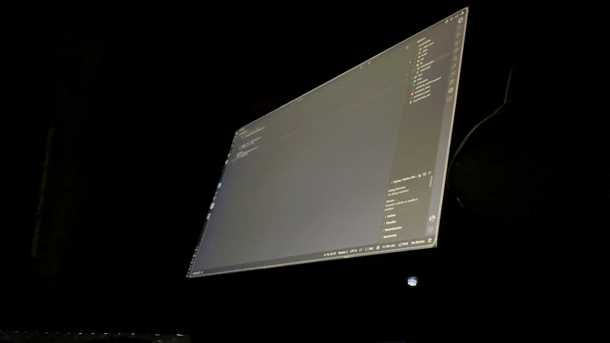

<pre>
                    'c.
                 ,xNMM.
               .OMMMMo
               OMMM0,            granthiksom@Granthiks-MacBook-Pro.local
     .;loddo:' loolloddol;.      ---------------------------------------
   cKMMMMMMMMMMNWMMMMMMMMMM0:    OS: GenZ
 .KMMMMMMMMMMMMMMMMMMMMMMMWd.    Host: Granthik Som
 XMMMMMMMMMMMMMMMMMMMMMMMX.      Kernel: brain
;MMMMMMMMMMMMMMMMMMMMMMMM:       Uptime: 20+ years
:MMMMMMMMMMMMMMMMMMMMMMMM:       Packages: 206 (bones)
.MMMMMMMMMMMMMMMMMMMMMMMMX.      Shell: Calcium
 kMMMMMMMMMMMMMMMMMMMMMMMMWd.    Resolution: 576 megapixels
 .XMMMMMMMMMMMMMMMMMMMMMMMMMMk   DE: Aqua
  .XMMMMMMMMMMMMMMMMMMMMMMMMK.   WM: Quartz Compositor
    kMMMMMMMMMMMMMMMMMMMMMMd     Theme: South Asian
     ;KMMMMMMMWXXWMMMMMMMk.      Terminal: Ghosty
       .cooc,.    .,coo:.       
                                
</pre>

  

 

  
  
  
  
  

## 🧑‍💻 About Me

<table>
  <tr>
    <td width="40%" align="center">
      
    </td>
    <td width="60%">
      <h3></h3>
      <ul>
        <li>🔭 Focused on building <b>cross-platform apps with Flutter</b></li>
        <li>⚙️ Exploring <b>native & FFI</b> integration for performance-critical features</li>
        <li>🔌 Curious about <b>electronics & embedded systems</b></li>
        <li>🎨 Passionate about clean, intuitive <b>UI engineering</b></li>
        <li>🚀 Always optimizing for <b>speed and memory efficiency</b></li>
        <li>🌱 Currently leveling up on native tooling and systems-level programming</li>
      </ul>
    </td>
  </tr>
</table>

---

## 🛠️ Tech Stack

**Languages & Frameworks**

  

**Tools & Platforms**

  

---

## 🚀 Interests

| Area                     | Description                                 |
| ------------------------ | -------------------------------------------- |
| 📱 Cross-platform Apps   | Flutter-first, pixel-perfect experiences     |
| ⚙️ Native & FFI          | Bridging Dart with native performance        |
| 🔌 Electronics & Systems | Where hardware meets software                |
| 🎨 UI Engineering        | Beautiful and intuitive interfaces           |
| 🚀 Optimization          | Performance and memory-focused development   |

---

## 📈 GitHub Analytics

  

  

---

## 📫 Connect With Me

  
  
  
  

 

### 💻 Thanks for stopping by!

